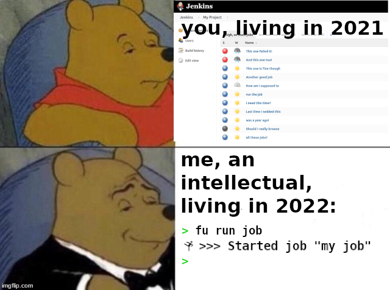

# furbnicator

A tool to simplify everyday tasks for the common corporate programmer.

In other words:

- Coworker: "Can you help me out here real quick?"

  You: "Sure, just gimme the name of your repo and I'll `fu` me the source.
        Did you know I hate browsing code via web?"

- You without `fu`: "Damn, why do I need to click this friggin build job again?"
  *scrolls through pages of jenkins jobs...*

  You with `fu`: "Easy, i can filter the list in my terminal. Oh, wait, I'll
  just `Ctrl` `R` it."

  

## What

furbnicator consists of various (ok, more than one) modules, each supporting a
distinct system or task. Each module provides a list of actions and batarang is
in the end not much more than a simple interface to search & execute the tasks
provided by all activated modules.

### Bitbucket

The bitbucket server module can index repositories from bitbucket.org.
Especially handy if you regularly need to browse or clone repositories. If you
work with a single repo most of the time, this module might not help you very
much.

#### Tasks

- Clone repositories
- Browse repositories

### Jenkins

The jenkins meodule can index the jobs in a single jenkins installation.

#### Tasks

- Run jobs
- Browse jobs

#### Possible enhancements

- Browse Job after it is run
- Download artefacts after job is run

### Timestamps

Displays the current unix or java timestamp.

### Bitbucket server

#### Deprecation warning

This module is deprecated since atlassian eol'ed the on premise version of
bitbucket.

The bitbucket server module can index repositories from a single bitbucket
server installation. Especially handy if you regularly need to browse or clone
repositories. If you work with a single repo most of the time, this module might
not help you very much.

#### Tasks

- Clone repositories
- Browse repositories

## Demo run

tbd.

## Install, Configuration and Usage

### Install

It puts the executable in the $PATH. Mac users might want to rename the file.

### Configuration

Create a file  `~/.config/furbnicator/furbnicator.yaml`. Please see
[example_furbnicator.yaml](docs/example_furbnicator.yaml) for details.

### Usage

- `fu -h` get help
- `fu -u` update data. Run this periodically to keep up to date with remote data
  (like available repositories)
- `fu` show all available actions. Select ohne with the arrow keys. Press enter
  to run selected action. Cancel via `Ctrl`+ `C`
- `fu any text` only show actions with tags containing "any" and "text"
- `fu +any text` only show actions with a tag starting with "any" and a tag
  containing "text"
- `fu +any text+` only show actions with a tag starting with "any" and a tag
  ending with "text"

If your search terms lead to only one possible action, you will be prompted to
run the action immediately. Use `-l` (feeling lucky) to skip this promt:

- `fu -l +clone analyzer` clone the repo containing "analyzer" right away - but
  only if there is just one.

## Todo

### Notification Module

Get notifications for noteworthy stuff. Like newly created bitbucket repos in
your ogranization.

### RobinModule

The RobinModule will support external task definitions e.g. shell scripts. You
might wonder why you need a task runner to run shell scripts if you already have
... a shell. Well, don't ask me :D

### Spotify

People will never take us seriously without this ;)

- mpris would work without much hassle, but only on linux
- web api would work cross platfrom, but isn't fun because authorization
- go with mpris. if anyone wants windows/mac, they can open pr with scripting
  solutions

### Web search (ddg)

- https://github.com/psheets/ddgquery

## Build

- `go build`

## Disclaimer

- I tried to bang out a golang project as fast as I could without knowing much
  about the language before. Code quality wasn't a concern.
- I never tested this on macOS or windows.

## License

EUPL-1.2

- See [LICENSE](LICENSE)
- See https://joinup.ec.europa.eu/collection/eupl
